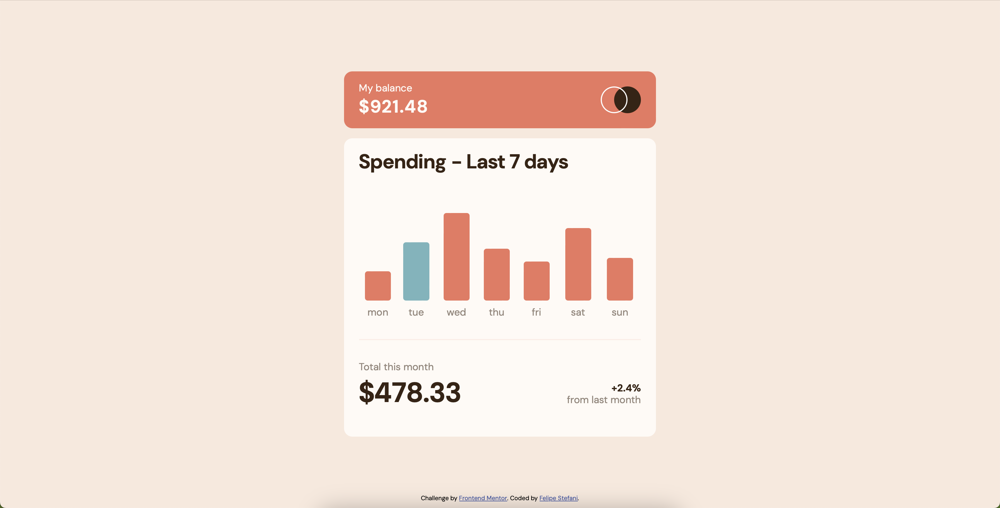

## About me

- LinkedIn - [Felipe Stefani](https://www.linkedin.com/in/felipe-stefani-a35185116/)
- Instagram - [@felipestefani](https://www.instagram.com/felipestefani/)
- Frontend Mentor - [@felipestefani](https://www.frontendmentor.io/profile/felipestefani)

# Frontend Mentor - Expenses chart component solution

This is a solution to the [Expenses chart component challenge on Frontend Mentor](https://www.frontendmentor.io/challenges/expenses-chart-component-e7yJBUdjwt). Frontend Mentor challenges help you improve your coding skills by building realistic projects. 

## Table of contents

- [Overview](#overview)
  - [The challenge](#the-challenge)
  - [Screenshot](#screenshot)
  - [Links](#links)
- [My process](#my-process)
  - [Built with](#built-with)
- [Author](#author)

## Overview

### The challenge

Users should be able to:

- View the bar chart and hover over the individual bars to see the correct amounts for each day
- See the current day’s bar highlighted in a different colour to the other bars
- View the optimal layout for the content depending on their device’s screen size
- See hover states for all interactive elements on the page
- **Bonus**: Use the JSON data file provided to dynamically size the bars on the chart

### Screenshot

### Links

- Solution URL: [https://github.com/felipestefani/expenses-chart](https://github.com/felipestefani/expenses-chart)
- Live Site URL: [https://felipestefani.github.io/expenses-chart/](https://felipestefani.github.io/expenses-chart/)

## My process

### Built with

- Semantic HTML5 markup
- CSS custom properties
- Flexbox
- [React](https://reactjs.org/) - JS library
- [Type Script](https://www.typescriptlang.org) - TypeScript

## Author

- LinkedIn - [Felipe Stefani](https://www.linkedin.com/in/felipe-stefani-a35185116/)
- Instagram - [@felipestefani](https://www.instagram.com/felipestefani/)
- Frontend Mentor - [@felipestefani](https://www.frontendmentor.io/profile/felipestefani)

